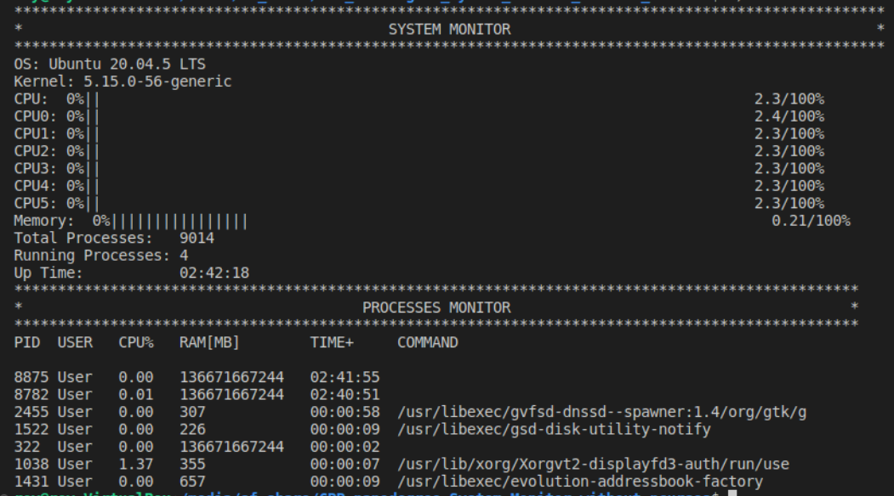

# CPP_nanodegree_System_Monitor_without_ncurses

 This is the second project in the CPP nanodegree. I have done some modification and removed one of the requirements (ncurses), so it can run in the terminal. I also made a new makefile so I can compile with g++ on linux system.
 All the system enquires are the same as the original project. (see the image for a final result).

 To compile use the command:
    `make monitor`
 To clean the object files,  use the command:
    `make clean`
 To run the program, use the command:
    `./monitor`

    
